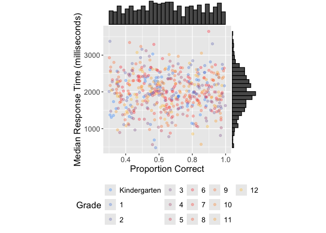

<!-- README.md is generated from README.Rmd. Please edit that file -->

# roarutility

<!-- badges: start -->

<!-- badges: end -->

The goal of roarutility is to process ROAR data. It provides convenience
functions to make some common cleaning and processing tasks with ROAR
data a bit easier.

## Installation

Install the package, once you have access to the roarutility repository,
by running the following code.

``` r
# install.packages("pak")
pak::pak("yeatmanlab/roarutility")
library(roarutility)
```

## Usage

### roar.read.csv

This is a basic example which shows you how to read in ROAR data and
remove opt-outs in one line of code.

``` r
library(roarutility)
new_data <- roar.read.csv("all_runs.csv", 
              "~/Documents",
              "google.drink.link")
```

Notice how the output dataframe has removed all possible opt-outs from
the most up-to-date opt-out CSV.

### clean_strings

This is a basic example which shows you how clean_strings() takes in
data and outputs data that has removed extra characters from assigning
organization variables and converted empty strings to NA values.

``` r
library(roaryutility)
test_df <- data.frame(
  assigning_schools = c("[irNgj3c]", "irNgj3c"),
  age = c("", "6.7")
)

clean_df <- clean_strings(test_df) 
clean_df 
#   assigning_schools  age
# 1           irNgj3c <NA>
# 2           irNgj3c  6.7
```

Notice how the output dataframe has removed the “\[\]” characters from
the assigning_schools variable and has converted the empty string value
in age to an NA value.

### remove_empty_cols

This is a basic example which shows you how remove_empty_cols() takes in
a dataframe with a column with all NA values and outputs data that has
removed the columns with all NA values.

``` r
library(roarutility)
test_df <- data.frame(
  firstname = c("Jane", "John", NA, "Kelly"),
  lastname = c("Doe", NA, NA, "Smith"),
  middlename = c(NA, NA, NA, NA)
)

clean_df <- remove_empty_cols(test_df) 
names(clean_df) 
# [1] "firstname" "lastname" 
```

Notice how the output dataframe has removed the column “middlename”
because it consisted of all NA values.

### remove_duplicates

This is a basic example which shows you how remove_duplicates() removes
all identical rows across every column.

``` r
library(roarutility) 
test_df <- data.frame(
  assessment_pid = c("123", "456", NA, "789", "123"),
  roarScore = c(45, 32, 34, 10, 45)
)

clean_df <- remove_duplicates(test_df)
clean_df$assessment_pid
#[1] "123" "456" NA    "789"
```

Notice how the last row test_df\[5,\] was removed because it had
identical values across both columns (assessment_pid and roarScore) as
the first row test_df\[1,\].

### remove_accounts

Removes all indicated accounts from the dataframe. Reseearchers can read
in data and indicate which or all of the following types of accounts
they would like to remove from the dataframe. The function defaults to
removing test, demo, pilot, and QA accounts and defaults to not removing
NA assessment_pid. The function runs through the organization IDs (i.e.,
assigning_districts, etc.). It also uses string detection to determine
if there are any “test”, “pilot”, “qa”, or “demo” strings within the
assessment_pid column. Finally, it runs through to determine if there
are test or demo using the variables is_test_data and is_demo_data (if
these accounts were chosen to be removed). If selected, the function
will also remove assessment_pid = NA.

### standardize_grade

This is a basic example which shows you how standardize_grade() uses a
grade variable and dataframe to create uniform values in grade.

``` r
library(roarutility)
test_df <- data.frame(user.grade = c("2", "1", "01", "2nd", "k",
                                     "Kindergarten", "1", "09"))
clean_df <- standardize_grade(test_df, "user.grade")
clean_df$user.grade
# [1] "2"            "1"            "1"           
# [4] "2"            "Kindergarten" "Kindergarten"
# [7] "1"            "9"  
```

Notice how the grades went from nonuniform values “2”, “2nd”, “01” to
more uniform values which can help researchers with filtering, faceting,
and overall data organizations.

### correct_historical_grade

This is a basic example which shows you how correct_historical_grade()
aligns grades across school years for students who have runs in more
than one year. It uses each student’s grade in the 2024-25 school year
(or the first year after it) as the reference and lines up earlier
grades with it. Run standardize_grade() first so grades are in a uniform
format.

``` r
library(roarutility)
test_df <- data.frame(
  roar_uid = c("A", "A", "B", "C", "C"),
  user_grade_at_run = c("5", "5", "3", "Kindergarten", "1"),
  time_started = c("2023-10-01 10:00:00 UTC", "2024-10-01 10:00:00 UTC",
                   "2023-10-01 10:00:00 UTC", "2023-10-01 10:00:00 UTC",
                   "2024-10-01 10:00:00 UTC")
)

clean_df <- correct_historical_grade(test_df)
# Earlier runs with a 2024-25 (or later) reference grade: 2 | updated: 1 (1 students)
clean_df
#   roar_uid user_grade_at_run            time_started grade_corrected
# 1        A                 4 2023-10-01 10:00:00 UTC            TRUE
# 2        A                 5 2024-10-01 10:00:00 UTC           FALSE
# 3        B                 3 2023-10-01 10:00:00 UTC           FALSE
# 4        C      Kindergarten 2023-10-01 10:00:00 UTC           FALSE
# 5        C                 1 2024-10-01 10:00:00 UTC           FALSE
```

Notice how student A’s 2023-24 run is updated from 5 to 4, one grade
below their 2024-25 grade, and is marked TRUE in the new grade_corrected
column. Student B only has a 2023-24 run, so there is no reference grade
and their grade stays the same. Student C’s grades already move up one
grade from Kindergarten to 1, so they stay the same too. Researchers can
set keep_diagnostics = TRUE to keep the school year, original grade, and
reference grade columns for review.

### filter_assessments

This is a basic example which shows you how filter_assessments maintains
the assessments that have completed runs in the first example and
completed, best, and reliable runs in the second example.

``` r
library(roarutility)
test_df <- data.frame(
  task_id = c("roam-alpaca", "swr", "sre", "letter", "sre-es", "swr-es"),
  completed = c("true", "true", "false", "true", "false", "false"),
  best_run = c(NA, "true", "false", "true", NA, NA),
  reliable = c(NA, "true", "false", "true", NA, NA)
)

clean_df <- filter_assessments(test_df) 
clean_df
#       task_id completed best_run reliable
# 1 roam-alpaca      true     <NA>     <NA>
# 2         swr      true     true     true
# 3      letter      true     true     true

clean_df <- filter_assessments(test_df, completed=TRUE, best_run=TRUE, reliable=TRUE)
clean_df
#   task_id completed best_run reliable
# 1     swr      true     true     true
# 2  letter      true     true     true
```

Notice how in the first example, filter_assessments() only keeps the
assessments where completed==“true”, but did not consider the values for
best_run and reliable. In the second example, we indicate that we also
want to consider best_run and reliable variables as well as completed.
As you can see, the function only keeps those which have all “true”
values.

### run_count

This is a basic example which shows you how run_count() numbers each
student’s runs in the order they took them and counts how many runs each
student has in total. By default, runs are counted separately for each
task.

``` r
library(roarutility)
test_df <- data.frame(
  assessment_pid = c("a", "a", "a", "b"),
  run_id = c("r2", "r1", "r1", "r3"),
  task_id = "swr",
  assessment_stage = c("test", "practice", "test", "test"),
  time_started = c("2025-03-01 10:00:00", "2024-10-01 10:00:00",
                   "2024-10-01 10:00:00", "2025-01-15 09:00:00")
)

counted_df <- run_count(test_df)
# Counted 3 run(s) for 2 student(s) across 1 task(s). Max runs per student/task: 2.
counted_df[, c("assessment_pid", "run_id", "assessment_stage", "run_count", "total_runs")]
#   assessment_pid run_id assessment_stage run_count total_runs
# 1              a     r2             test         2          2
# 2              a     r1         practice         1          2
# 3              a     r1             test         1          2
# 4              b     r3             test         1          1
```

Notice how student a’s run r1 is numbered 1 because it happened first,
even though it appears after r2 in the dataframe. Both rows of r1
(practice and test) get the same number because they belong to the same
run. Student a has 2 runs in total and student b has 1. Use task_col =
NULL to count all of a student’s runs together across tasks, or filter
to run_count == 1 to keep only each student’s first attempt.

### plot_scatter_histogram

This is an example which shows how you can use plot_scatter_histogram to
visualize user median response time and proportion correct on a ROAR
assessment.

``` r
library(roarutility)

# create dataframe 
n <- 500
grade_levels <- c("Kindergarten", "1", "2", "3", "4", "5", "6",
                  "7", "8", "9", "10", "11", "12")
test_df <- data.frame(
  user_grade_at_run = factor(
    sample(grade_levels, n, replace = TRUE)
  ),
  prop_correct = runif(n, 0.3, 1.0),
  median_rt = abs(rnorm(n, 2000, 500))
)

# plot the data 
plot_scatter_histogram(test_df, verbose=FALSE)
```



Notice how the plot includes a scatter plot with the median response
time on the y-axis and the proportion correct on the x-axis with each of
their individual distributions against perpendicular sides. This allows
researchers to visualize clear cutoffs for users/students who have been
responding too fast and/or who may have not been trying to correctly
answer the items within the assessment.
